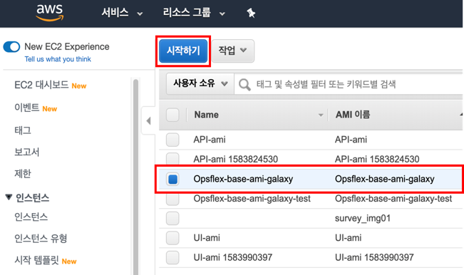

# Packer + Ansible Toolchain

## * Packer + Ansible Toolchain 빌드
### 1. git checkout
    /* make directory */
    cmd $ cd ~
    cmd $ mkdir workspace
    cmd $ cd workspace
    
    /* git clone */
    cmd $ git clone https://github.com/opsflex/ami.git
    cmd $ cd ~/workspace/ami

### 2. run script
    /* run script for use galaxy ansible */
    cmd $ chmod +x ./init_ansible_galaxy.sh
    cmd $ ./init_ansible_galaxy.sh
    

### 3. Role 편집
    cmd $ vi ~/workspace/ami/packer/playbook.yml
    
    [ Role 선택 방법 ]
        사용할 role 추가 및 편집
        사용하지 않는 role은 #을 통해 주석 처리

### 4. Packer bild
    cmd $ cd ~/workspace/ami/packer
    
    /* packer build */
    packer build default.json
    

### * Packer + Ansible Toolchain 이미지 확인
#### 1. AWS Console 로그인
     https://console.aws.amazon.com/   

#### 2. AMI 확인
     서비스 > EC2 > 이미지 > AMI 에서 생성된 이미지 확인   

#### 3. AMI 로 EC2 인스턴스 생성
     생성된 이미지 선택 > '시작하기' 버튼을 클릭하여 EC2 인스턴스 생성   

#### 4. EC2 인스턴스에서 설치된 항목 확인
     생성된 EC2에 접속하여 설치 리스트 확인   